# Likelihood and Bayesian methods for reconstructing phylogenies
## Art Poon
### BIOL 4289B - Biosystematics and Phylogenetics

---

# Learning objectives
<table>
<tr>
<td>
<ul>
<li>How do we model the probability of coin toss experiments?</li>
<li>How are probability and likelihood related?</li>
<li>How do we calculate the likelihood of a tree?</li>
<li>What is the Jukes-Cantor model?</li>
</ul>
</td>
<td>
<ul>
 <li>How many kinds of trees relate $n$ taxa?</li>
 <li>How do we explore tree space?</li>
 <li>What is Bayes' rule?</li>
 <li>What are pros and cons of Bayesian inference?</li>
</ul>
</td>
</tr>
</table>

---

# Likelihood

* To understand likelihood, you need to understand probability
* What is the probability of tossing 2 heads in 5 tries?
```
1.HHTTT  2.HTHTT  3.HTTHT  4.HTTTH  5.THHTT
6.THTHT  7.THTTH  8.TTHHT  9.TTHTH  10.TTTHH
```
`$${5\choose 2} = \frac{5!}{3!2!} = \frac{5\times 4\times 3\times 2\times 1}{3 \times 2\times 1 \times 2 \times 1} = 10$$`

---

# Modeling coin tosses

`$$P(H=2,N=5) = {5\choose 2} p^2 (1-p)^{(5-2)} $$`

<table><tr><td width=50%>
If it's a 'fair' coin, then $p=0.5$ and:

 $$P=10\times 0.5^5 = \frac{10}{32} = 0.3125$$
</td><td>
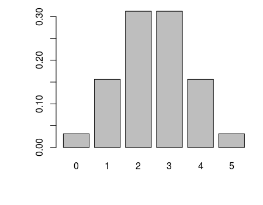
</td></tr></table>

---

# Probability and likelihood

<table>
<tr><td width=50%><ul>
  <li>Probability is a function of model outcomes (data)</li>
  <li>Likelihood is a function of model parameters  (hypothesis)</li>
  <li>Likelihood does not integrate/sum to 1</li>
</ul></td>
<td>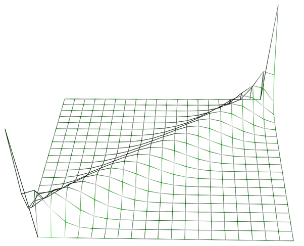</td>
</tr>
</table>

---

# Likelihood for evolution

<table>
<tr>
    <td width="50%">
    <ul>
        <li>Need a model of sequence evolution</li>
        <li>e.g., Jukes-Cantor model</li>
    <ul>
    <small>
    `$$ P(i,j|t) = \left\{ \begin{array}{lr}
    \frac{1}{4} + \frac{3}{4}e^{-\frac{4}{3}t} & if i= j \\
    \frac{1}{4} - \frac{1}{4}e^{-\frac{4}{3}t} & if i\ne j \\
    \end{array} \right. $$`
    </small>
    </td>
    <td>
        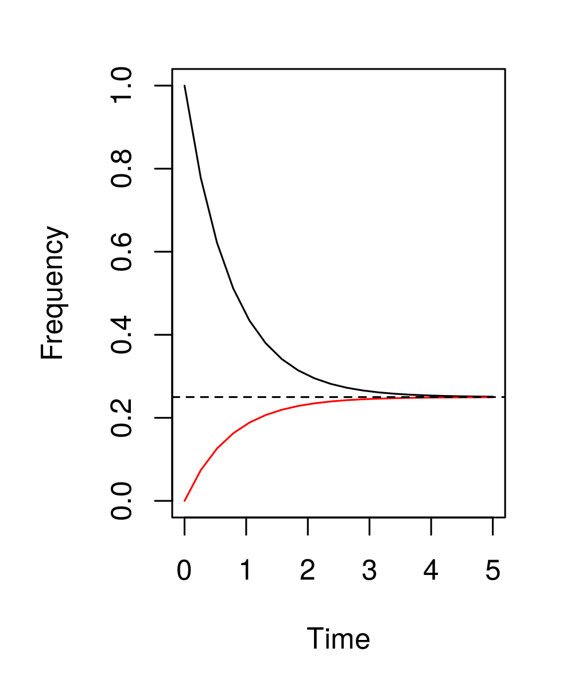
    </td>
</tr>
</table>

---

# Standard substitution models

* Jukes-Cantor (**JC69**) - equal rates, equal base frequencies
* Felsenstein (**F81**) - unequal base frequencies
* Hasegawa-Kishino-Yano (**HKY85**) - let transitions and transversions have different rates
* Tamura-Nei (**TN93**) - two different transition rates
* **GTR** - generalized time reversible model

---

# Likelihoods of trees

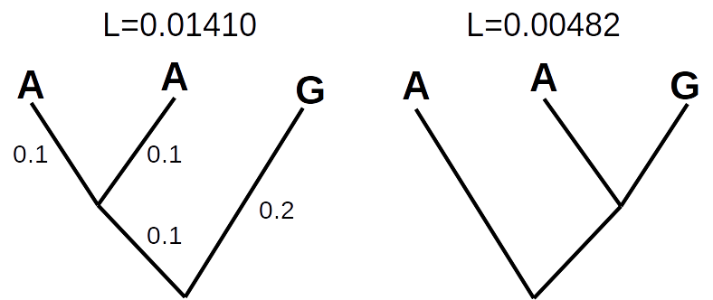

---

# Finding maximum likelihood

<table>
<tr>
  <td width="50%"><ul>
    <li>For most problems, there is no exact solution</li>
    <li>Use an optimization method to search for solution</li>
    <li>The danger is getting trapped in local optima!</li>
  </ul></td>
  <td></td>
</tr>
</table>

---

# Tree space is enormous!

| Number of tips | Number of trees | ..is like |
|----------------|-----------------|-----------|
| 3              | 3               | |
| 5              | 105             | |
| 10             | 34,459,425        | Population of Canada |
| 15             | $2.13\times 10^{14}$ | Total number of ants |
| 20             | $8.2\times 10^{21}$ | All grains of sand on all beaches |
| 25             | $1.2\times 10^{30}$ | All bacteria on Earth |

---

# How do we search tree space?

* Needed to develop "rearrangements" to move between similar trees.
* Nearest-neighbor interchange - swap two subtrees that share a common edge:

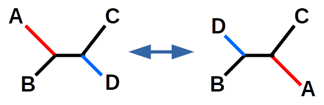

---

# Subtree prune and regraft

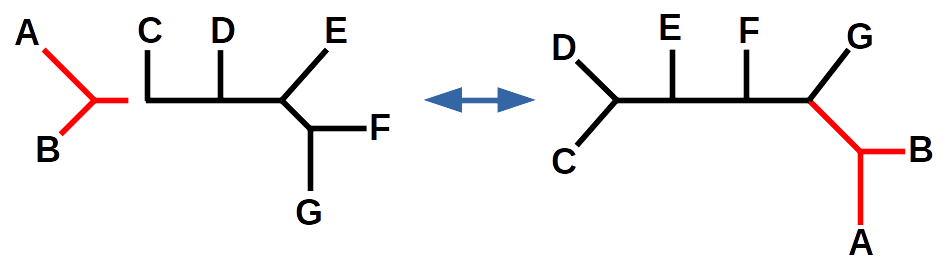
<small>Based on a figure by Steven A. Carr, modified from Krane & Raymer 2004.</small>

---

# Software

| | |
|-|-|
| [PAUP*](http://paup.sc.fsu.edu/) | Commercial license, packaged with [Geneious](http://www.geneious.com/) |
| [MEGA](http://megasoftware.net)  | Freeware, closed |
| [PhyML](http://www.atgc-montpellier.fr/phyml/) | Open source |
| [RAxML](http://sco.h-its.org/exelixis/software.html) | Open source |
| [FastTree2](http://www.microbesonline.org/fasttree/) | Open source, approximate ML |
| [GARLi](http://www.bio.utexas.edu/faculty/antisense/garli/Garli.html) | Open source, uses genetic algorithm |

<small>Not an exhaustive list!</small>

---

# Bayes' rule

* Likelihood is based on the probability of the data given the hypothesis.
* We know the data exist!  We want to test the hypothesis!

<center>
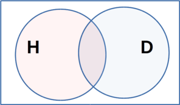
</center>

---

# Bayes' rule

`$$P(H|D) = \frac{P(D|H) P(H)}{P(D)}$$`

* $P(D|H)$ is the likelihood
* $P(H)$ is the prior - our belief about $H$ before seeing the data
* $P(H|D)$ is the posterior - our belief about $H$ after seeing the data
* $P(D)$ is the probability of the data: $\int_{H} P(D|H)P(H)$

---

# Back to tossing coins

* Your prior belief about a coin is that it is probably fair.

* Let's represent that belief with a beta distribution:
<center>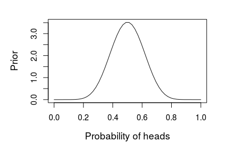</center>
<small>This represents our belief based on having flipped other coins 20 times and getting 10 heads.</small>

---

# Updating our belief

* Suppose we did coin toss experiments with a coin that is actually biased ($p=0.4$)
* Here is what it looks like to update our posterior belief:
<center>
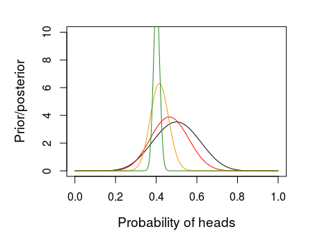
</center>

---

# Why be Bayesian?

* ML only provides a single "point" estimate
* Bayesian methods can sample from multiple optima
* Highly versatile, can adapt to a limitless number of models
* Can handle missing data
* Can be more computationally demanding

---

# Markov chain Monte Carlo

* Monte Carlo is solution by simulation
* *e.g.*, what is the probability of winning at solitaire?
* simulating from random parameter settings can be grossly inefficient
* solution: let the next parameter settings to evaluate be close to the current set
* this defines a "random walk" in which the probability of the next step depends *only* on the current state (Markov chain)

---

# Diagnosing MCMC

<table>
    <tr>
    <td width="50%">
    <ul>
    <li>An MCMC sample usually needs some time to move from the initial values to favourable parameter combinations.</li>
    <li>This initial period is called the "burn-in" and is removed.</li>
    </ul>
    </td>
    <td>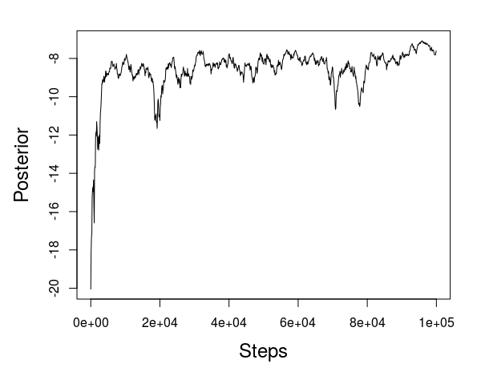</td>
    </tr>
</table>

---

# Convergence
* In the long run, the distribution of parameters visited by the MCMC sample should *converge* to the true posterior distribution
* There is no way to guarantee that your sample has converged!
* A fair approach is to run more than one chain, and see if they have similar distributions.

---

# Software

* [Mr. Bayes](http://mrbayes.sourceforge.net/)
* [BEAST](http://beast.bio.ed.ac.uk/) - Bayesian evolutionary analysis by sampling trees
* [BAli-Phy](http://www.bali-phy.org/) - simultaneous inference of alignment and phylogeny
* [PhyloBayes](http://megasun.bch.umontreal.ca/People/lartillot/www/index.htm) - designed for phylogenomics
* [BAMBE](http://www.mathcs.duq.edu/larget/bambe.html) - no longer maintained

---

## West African outbreak of Ebolavirus
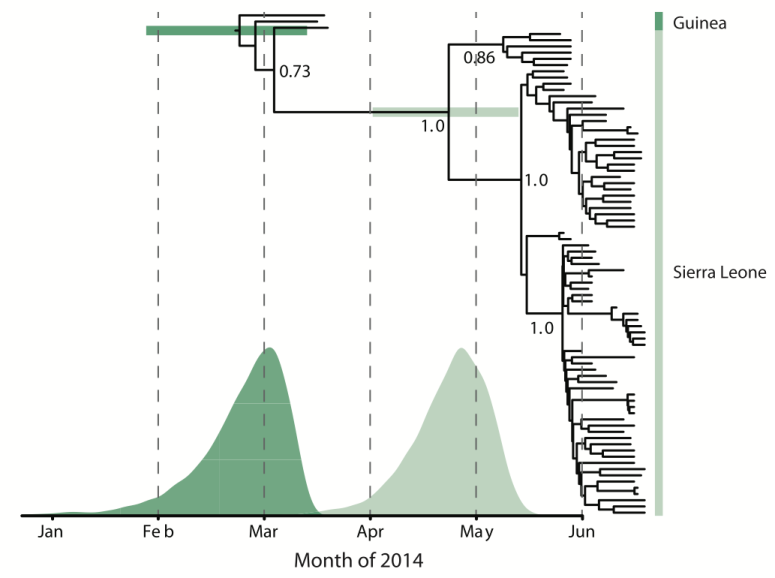
<small>Source: Trevor Bedford</small>

---

## Fossil and molecular Bayesian phylogeny of penguins

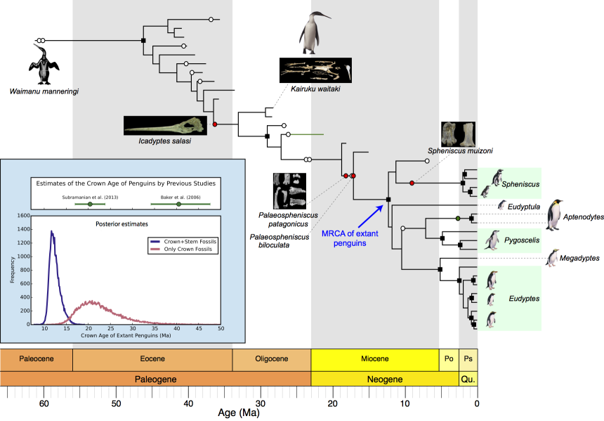
<small>Source:  Tanja Stadler</small>
