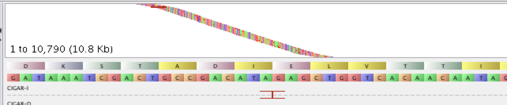

# Secuenciaci&oacute;n de pr&oacute;xima generaci&oacute;n para la evoluci&oacute;n del virus
<!--- Next-generation sequencing analysis for virus evolution -->
## Art Poon [@GitHub](github.com/ArtPoon)

#### Departments of Pathology and Laboratory Medicine; Microbiology and Immunology; Applied Mathematics at Western University, Ontario, Canada


# &iquest;Por qu&eacute; necesitamos aprender a codificar?

* Secuenciaci&oacute;n de nueva generaci&oacute;n (SPG) datos son masivos
* difficult to analyze with conventional software (e.g., Excel)
* Bioinformatic tools for NGS analysis are extremely valuable
* The majority of tools are designed for human genomics; metagenomics
* Virus populations are too diverse - we need to make our own tools


# &iquest;Qu&eacute; significa codificar?

* You can't make a button for everything
* Command-line interface offers unlimited versatility
* The open source community provides many powerful resources for free (*e.g.* R)
* Unix-like systems have become the standard for bioinformatics
* The downside is that there is a steep learning curve


# Meet the command line

 


# Sistemas SPG

* Usually people are dealing with 454, Ion Torrent and Illumina
* 454 is an abandoned platform
* 454 and Ion Torrent have insurmountable issues with homopolymer errors
* Illumina a *de facto* standard until better options become mainstream


# The Illumina data files

* Raw data files are too large to allow these to accumulate uncompressed
* Compression reduces file size by about X fold
* Uncompress a file as follows:
```
# go to directory where you checked out courses.git
cd courses/Cuernavaca
gunzip --keep data/Zika-envelope.n1E4.R1.fastq.gz
```


# FASTQ format

```
% head -n4 data/Zika-envelope.n1E4.R1.fastq
@otu1-2/1
CCGGGATCTTGTTGATTGTGAACGCTGCGGTACCTAAGGATGACACGCCTTTCAATCCATGTTTGTCCGTT
+
*F#FG#FFGGG#DGG#A2GGG?GGGC8G#EGGF#FGGGGGGGGEFGFGGFGGGGFFGGGE;G*GGGG/GGG
```
* Illiumina quality scores encoded as follows (see also [Wikipedia](https://en.wikipedia.org/wiki/FASTQ_format#Encoding)):
```
!"#$%&'()*+,-./0123456789:;<=>?@ABCDEFGHIJ
|                              |         |
0                              31        41
```


# Quality scores

* An empirical estimate of the probability that the base call is incorrect:
  
  $$Q = -10 \log_{10} P$$
  
* Based on instrument calibration by manufacturer. 
* Not all error variation is represented by these scores! 


# Clinical significance of tile/cycle errors

* Every subtype B sample in a MiSeq run had a substantial frequency (~3%) of resistance mutation E138A
* Quality scores were fine!


# Bad tile/cycle combination


* Not necessarily a big problem for random libraries
* Can be a really big problem for amplicon libraries!


# InterOp files

* These are binary files (not human readable) that store quality and error metrics associated with the run.
* Try this:
```
less ErrorMetricsOut.bin
```
* Contents of this file are documented [here](http://support.illumina.com/content/dam/illumina-support/documents/documentation/software_documentation/sav/sequencing-analysis-viewer-v1_8_46-guide-15066069-a.pdf)
* We want to access the tile/cycle-specific &phi;X174 error rates contained in `ErrorMetricsOut.bin`


# Processing InterOp

* Try this (Python 2 only!):

```
% mkdir sandbox
% python scripts/parse-interop.py data/ErrorMetricsOut.bin \
  sandbox/errorrates.csv
% Rscript scripts/error-metrics.R sandbox/errorates.csv \
  sandbox/errorrates.pdf
```


# Visualizing error rates


# Alineaci&oacute;n

* There are two general approaches to aligning short read data:

 1. *de novo* assembly of reads into contigs
 2. mapping to a reference genome

* *de novo* assembly can be a reasonable option if your objective is the consensus genome sequence
* reference mapping is better if your objective is variant detection


# Herramientas de m&oacute;dulo de mapeo basado en la referencia

* Generally work on the principle of looking up sequence fragments in a reference index
* Break down reference genome into fragments and record location of each
* Permit mismatches by augmenting index with all 1- and 2-off variants
* There are many mappers (BWA, bowtie2) with none clearly superior


# bowtie2

* Can index 2-off variants
* Allows soft clipping (5' or 3' end of read can be excluded from index query)
* Efficient "Smith-Waterman" alignment to reference after indexing


# Ejecutando bowtie2

* Create a reference index

```
bowtie2-build -q data/Zika-reference.fa data/zika
```

* Map Illumina data to index

```
bowtie2 -x data/zika -1 data/Zika-envelope.n1E4.R1.fastq.gz \
-2 data/Zika-envelope.n1E4.R1.fastq.gz \
 -S sandbox/first.sam
```


# Muy poco lecturas mapeadas a la referencia
```
10000 reads; of these:
  10000 (100.00%) were paired; of these:
    10000 (100.00%) aligned concordantly 0 times
    0 (0.00%) aligned concordantly exactly 1 time
    0 (0.00%) aligned concordantly >1 times
    ----
    10000 pairs aligned concordantly 0 times; of these:
      0 (0.00%) aligned discordantly 1 time
    ----
    10000 pairs aligned 0 times concordantly or discordantly; of these:
      20000 mates make up the pairs; of these:
        19979 (99.89%) aligned 0 times
        21 (0.10%) aligned exactly 1 time
        0 (0.00%) aligned >1 times
0.10% overall alignment rate
```


# &iquest;Que pas&oacute;?

* Rapid evolution of viruses means that references may be poor fit to data
* Try more lenient mapping (soft clips):

```
bowtie2 -x data/zika -1 data/Zika-envelope.n1E4.R1.fastq.gz \
-2 data/Zika-envelope.n1E4.R1.fastq.gz \
 -S sandbox/local.sam --local
```

* Now 6.85% overall alignment rate
* Better, but not good...


# Examinar los resultados de la mapeo

* Tablet: Java-based tool for visualizing SAM/BAM outputs
* Provides an interactive coverage plot.
* Try it out!


# Mapeo adaptative de la referencia

* Most groups have adopted the approach of adapting the reference sequence
* Update reference with the consensus of whatever reads could be mapped
* The reference should eventually converge to the ideal consensus sequence
* Stop when there is no improvement in the number of reads mapped


# Formato SAM

* Based on [SAMtools](https://github.com/samtools/samtools) programs (SAM = sequence alignment/map)
* `.sam` has become a *de facto* standard output format for short read mappers

| # | Name  | Description          | #  | Name  | Description          |
|---|-------|----------------------|----|-------|----------------------|
| 1 | QNAME | Read label           | 7  | RNEXT | Ref. seq. of mate    |
| 2 | FLAG  | Bitwise flags        | 8  | PNEXT | Map location of 1st  |
| 3 | RNAME | Reference seq.       |    |       | base in mate         |
| 4 | POS   | Map location of 1st  | 9  | TLEN  | Insertion length     |
|   |       | base in read         | 10 | SEQ   | Read sequence        |
| 5 | MAPQ  | Mapping quality      | 11 | QUAL  | Read quality string  |    
| 6 | CIGAR | *see next slide*     |    |       |                      |


# CIGAR

* Compact Idiosyncratic Gapped Alignment Report
* A string representation of how the read aligns to the reference

| Token | Description |
|-------|-------------|
| M     | Matched     |
| I     | Insertion   |
| D     | Deletion    |
| S     | Soft clip   |

* For example, `5S45M1I4M5I89M1S`


# Adaptaci&oacute;n del consenso 

* My experience has been that *samtools* is confusing and poorly maintained
* Coded my own method in Python
  ```
  python scripts/adapt-ref.py sandbox/local.sam \
   data/Zika-reference.fa \
   sandbox/updated.fa
  ```

* Result:
  ```
  NC_012532.1, original length 10794
  Reads cover interval of length 1496
  Updated reference with 220 differences
  ```


# &iquest;Funciona?
 
* Try remapping FASTQ files to new reference

```
bowtie2-build -qf sandbox/updated.fa sandbox/updated

bowtie2 -x sandbox/updated \
 -1 data/Zika-envelope.n1E4.R1.fastq \
 -2 data/Zika-envelope.n1E4.R2.fastq \ 
 -S sandbox/updated.sam
```


# &iexcl;Si, funciona!

```
10000 reads; of these:
  10000 (100.00%) were paired; of these:
    403 (4.03%) aligned concordantly 0 times
    9597 (95.97%) aligned concordantly exactly 1 time
    0 (0.00%) aligned concordantly >1 times
    ----
    403 pairs aligned concordantly 0 times; of these:
      0 (0.00%) aligned discordantly 1 time
    ----
    403 pairs aligned 0 times concordantly or discordantly; of these:
      806 mates make up the pairs; of these:
        749 (92.93%) aligned 0 times
        57 (7.07%) aligned exactly 1 time
        0 (0.00%) aligned >1 times
96.25% overall alignment rate
```


# Podemos seguir...

```
$ python scripts/adapt-ref.py sandbox/updated.sam \ 
  sandbox/updated.fa sandbox/updated2.fa
NC_012532.1, original length 10790
Reads cover interval of length 1501
Updated reference with 10 differences
...
97.80% overall alignment rate
```

* but no improvement after third iteration.


# Echemos un vistazo al resultado de nuevo




# &iexcl;Esto no es &uacute;til!

* Not a convenient format for studying evolution

* Low probability of overlap between two mapped reads chosen at random.

* Paired-end reads are on separate lines.

* What we would really like is an alignment of the merged and aligned 
reads covering a specific interval.


# Otro script de Python

```
python scripts/slice-sam.py -h  # see help menu first

python scripts/slice-sam.py sandbox/updated.sam \ 
 sandbox/slice-1700-2000.fa  -refname NC_012532.1 \
 -left 1700 -right 2000 -min_overlap 250 -maxN 0.1 -qcut 15
```
